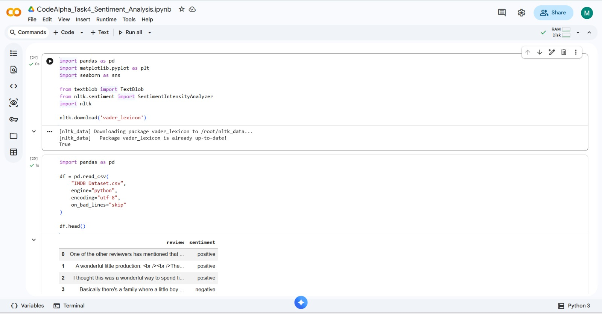
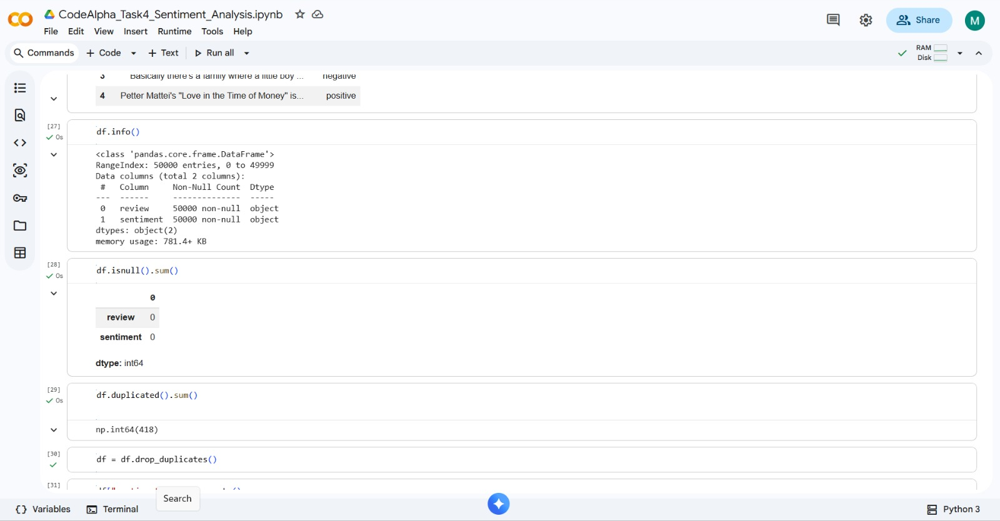
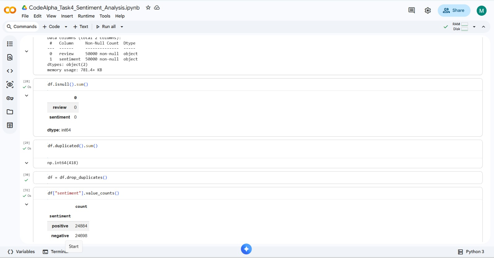
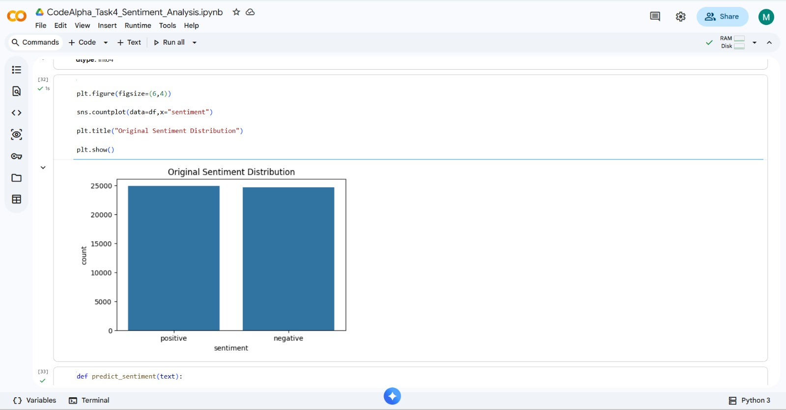
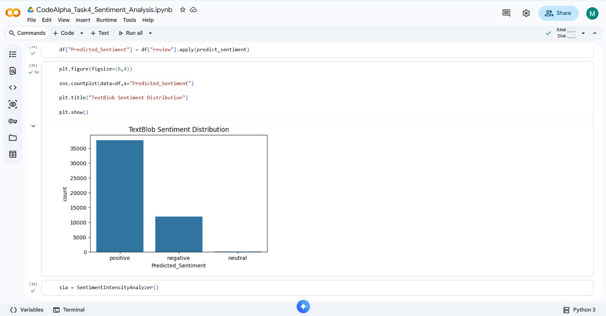
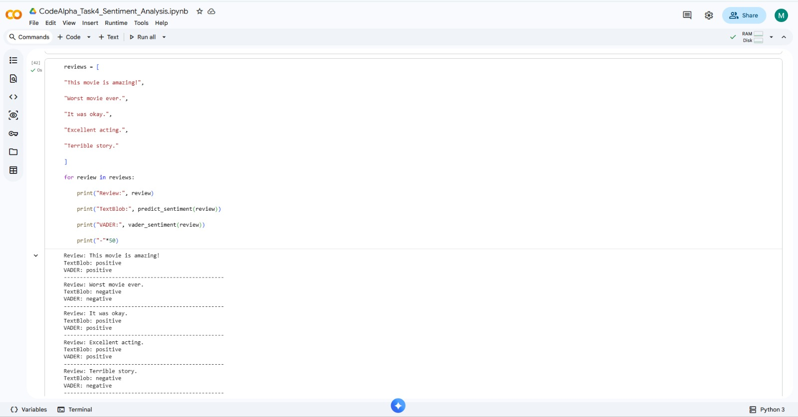
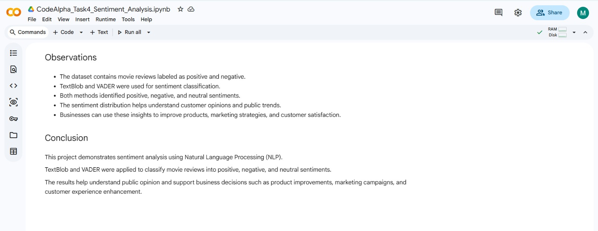

# 🎬 CodeAlpha Task 4: Sentiment Analysis using NLP

## 📌 Internship

**CodeAlpha Data Analytics Internship**

---

## 📖 Project Overview

This project performs **Sentiment Analysis** on IMDB movie reviews using **Natural Language Processing (NLP)** techniques. The reviews are classified into **Positive**, **Negative**, or **Neutral** sentiments using **TextBlob** and **VADER (Valence Aware Dictionary and Sentiment Reasoner)**.

The project demonstrates how NLP can be used to understand public opinion and customer feedback through sentiment classification and visualization.

---

## 🎯 Objectives

- Analyze text data using NLP.
- Classify reviews as Positive, Negative, or Neutral.
- Apply TextBlob and VADER sentiment analyzers.
- Visualize sentiment distribution.
- Generate insights for business decision-making.

---

## 🛠️ Technologies Used

- Python
- Google Colab
- Pandas
- Matplotlib
- Seaborn
- TextBlob
- NLTK (VADER)

---

## 📂 Dataset

- **Dataset:** IMDB Movie Reviews Dataset
- **Columns:**
  - `review`
  - `sentiment`

---

## 📊 Project Workflow

1. Import required libraries.
2. Load the IMDB dataset.
3. Explore the dataset.
4. Check missing values.
5. Remove duplicate records.
6. Visualize original sentiment distribution.
7. Perform sentiment analysis using TextBlob.
8. Perform sentiment analysis using VADER.
9. Compare sentiment predictions.
10. Visualize the results.
11. Test custom reviews.
12. Export the final output.

---

## 📈 Results

The project successfully classified movie reviews into positive, negative, and neutral sentiments.

Two NLP techniques were used:

- ✅ TextBlob
- ✅ VADER Sentiment Analyzer

Both methods produced meaningful sentiment predictions and helped analyze overall opinion trends in the dataset.

---

## 📷 Output Screenshots

### Dataset Preview



---

### Dataset Information



---

### Missing Values



---

### Original Sentiment Counts



---

### TextBlob Sentiment Distribution


---

### VADER Sentiment Distribution



---

### Custom Predictions



---

### Final Output



---

## 📁 Project Structure

```
CodeAlpha_Task4_Sentiment_Analysis/
│── CodeAlpha_Task4_Sentiment_Analysis.ipynb
│── README.md
│── IMDB Dataset.csv
│── Sentiment_Analysis_Output.csv
│── dataset_preview.jpeg
│── dataset_info.jpeg
│── missing_values.jpeg
│── sentiment_counts.jpeg
│── textblob_distribution.jpeg
│── vader_distribution.jpeg
│── custom_predictions.jpeg
│── final_output.jpeg
```

---

## 💡 Business Insights

- Most reviews express strong positive or negative opinions.
- Sentiment analysis helps organizations understand customer satisfaction.
- Negative reviews highlight areas for product or service improvement.
- Businesses can use these insights to improve marketing strategies and customer experience.

---

## ✅ Conclusion

This project demonstrates how **Natural Language Processing (NLP)** techniques can classify customer opinions effectively. By using **TextBlob** and **VADER**, the sentiment of movie reviews was analyzed and visualized, providing meaningful insights that support data-driven decision-making.

---

## 👩‍💻 Author

**Kapa Sri Lakshmi**

**CodeAlpha Data Analytics Internship**
